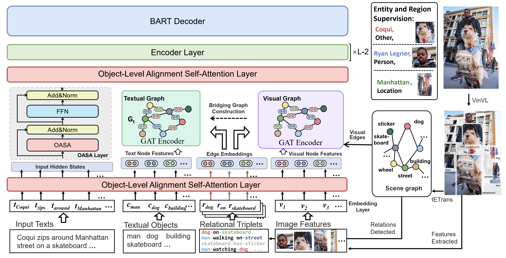

# README

This repo provides the source codes & data for our paper, *"RADAR: Relation-Assisted Dual-graph Aligning Recognition for Grounded MNER"* .

## Overview
RADAR is proposed to efficiently utilize visual relations in scene graphs for cross-modal entity alignment and Grounded MNER reasoning. An auxiliary textual scene graph is introduced for explicit object-level alignment and bridging the modality gap. Through cross-modal dual-graph alignments assisted by relational features and structures, RADAR significantly eases the process of approaching the ground truth. The framework is shown in Figure 1.


<p align="center">
    Figure1: Our Framework of RADAR: Relation-Assisted Dual-graph Aligning Recognition. 
</p>

Our codes are modified from the baseline [GMNER](https://github.com/NUSTM/GMNER), please refer to their README(https://github.com/NUSTM/GMNER/blob/main/README.md) for the dataset usage. For Ablation Study, we split the GMNER dataset into *Grounded Twitter2015* and *Grounded Twitter2017*, needing only change the data directory into the corresponding *txt_dir*  in `data/txt`.
## Dataset

The dataset released by [GMNER](https://github.com/NUSTM/GMNER)  is built on two benchmark MNER datasets, i.e., Twitter-15 (Zhang et al., 2018) and Twitter-17 (Yu et al., 2020).

- The preprocessed CoNLL format files are provided in this repo. For each tweet, the first line is its image id, and the following lines are its textual contents.
- Step 1：Download each tweet's associated images via this link (<https://drive.google.com/file/d/1PpvvncnQkgDNeBMKVgG2zFYuRhbL873g/view>)
- Step 2:  Use [VinVL](https://github.com/pzzhang/VinVL) to identify all the candidate objects, and put them under the folder named "Twitter10000_VinVL"( [Google Drive](https://drive.google.com/drive/folders/1w7W4YYeIE6bK2lAfqRtuwxH-tNqAytiK?usp=sharing) and [Baidu Netdisk](https://pan.baidu.com/s/1QqjOlAAjCqAk_qL6ejeARw?pwd=TwVi)).
- Step 3:  Use [IETrans](https://github.com/waxnkw/IETrans-SGG.pytorch) to extract all the relational triplets for each image with the candidate objects in Step 2 as input, and put them under the folder named "Twitter10000_IETrans"

## Requirement

- pytorch 1.7.1
- transformers 3.4.0
- fastnlp 0.7.0
```
conda install pyg -c pyg
```

## Usage

### Training for RADAR

```
sh train.sh
```

### Evaluation

```
sh test.sh
```

## Acknowledgements

- Using the dataset means you have read and accepted the copyrights set by Twitter and original dataset providers.
- Some codes are based on the codes of  [GMNER](https://github.com/NUSTM/GMNER), thanks a lot!
